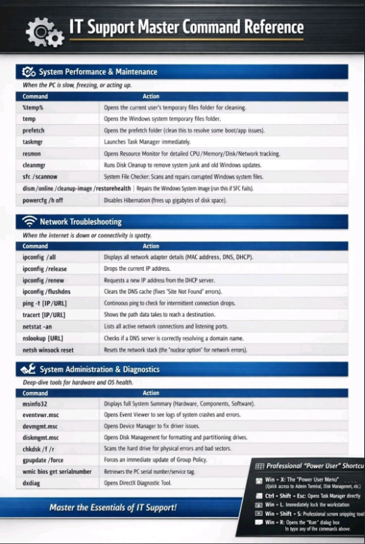

# 💡 Life Hacks

Tips produktivitas, shortcuts, dan trik berguna untuk kehidupan sehari-hari.

## ⚡ Quick Shortcut Reference

### 🖥️ IT Support Master Command Reference

Quick reference untuk command-command penting IT Support. Simpan dan gunakan saat troubleshooting!

#### System Performance & Maintenance

*When the PC is slow, freezing, or acting up.*

| Command | Action |
|---------|--------|
| `%temp%` | Opens the current user's temporary files folder for cleaning |
| `temp` | Opens the Windows system temporary files folder |
| `prefetch` | Opens the prefetch folder (data files to speed up Windows/app issues) |
| `taskmgr` | Launches Task Manager immediately |
| `resmon` | Opens Resource Monitor for detailed CPU/Memory/Disk/Network tracking |
| `cleanmgr` | Runs Disk Cleanup to remove system junk files and old Windows updates |
| `sfc /scannow` | System File Checker: Scans and repairs corrupted Windows system files |
| `dism /online /cleanup-image /restorehealth` | Repairs the Windows system image (use this if SFC fails) |
| `powercfg /h off` | Disables Hibernation (frees up gigabytes of disk space) |

#### Network Troubleshooting

*When the internet is down or connectivity is spotty.*

| Command | Action |
|---------|--------|
| `ipconfig /all` | Displays all network adapter details (MAC address, DNS, DHCP) |
| `ipconfig /release` | Drops the current IP address |
| `ipconfig /renew` | Requests a new IP address from the DHCP server |
| `ipconfig /flushdns` | Clears the DNS cache (fixes "Site Not Found" errors) |
| `ping -t [IP/URL]` | Continuous ping to check for intermittent network drops |
| `tracert [IP/URL]` | Shows the path data takes to reach a destination |
| `netstat -an` | Lists all active network connections and listening ports |
| `nslookup [URL]` | Checks if a DNS server is correctly resolving a domain name |
| `netsh winsock reset` | Resets the network stack (the "nuclear option" for network errors) |

#### System Administration & Diagnostics

*Deep dive tools for hardware and OS health.*

| Command | Action |
|---------|--------|
| `msinfo32` | Displays full System Information (Hardware, Components, Software) |
| `eventvwr.msc` | Opens Event Viewer to see logs of system crashes and errors |
| `devmgmt.msc` | Opens Device Manager to fix driver issues |
| `diskmgmt.msc` | Opens Disk Management for formatting and partitioning drives |
| `chkdsk /f /r` | Scans the hard drive for physical errors and bad sectors |
| `gpupdate /force` | Forces an immediate update of Group Policy |
| `wmic bios get serialnumber` | Retrieves the PC serial number/service tag |
| `control` | Opens DirectX Diagnostic Tool (for graphics/sound troubleshooting) |

---

## 📑 Daftar Tips

### Produktivitas

- [Keyboard Shortcuts Windows](./windows-shortcuts.md)
- [Cara Organize Files & Folders](./organize-files.md)
- [Email Management Tips](./email-management.md)

### Tools & Utilities

- [Screenshot Tools Terbaik](./screenshot-tools.md)
- [File Transfer Cepat](./fast-file-transfer.md)
- [Password Manager Setup](./password-manager.md)

### Optimasi Waktu

- [Automation dengan Scripts](./automation-scripts.md)
- [Batch Rename Files](./batch-rename.md)
- [Quick Search Tips](./quick-search.md)

---

**Total Tips**: 1 (IT Command Reference added)
